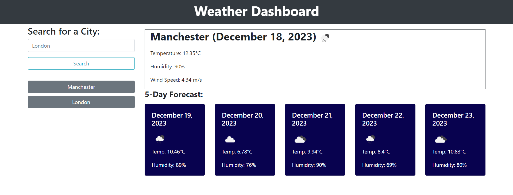

# Weather-Dashboard

## Overview

The Weather App is a dynamic web application that leverages a weather API to provide users with real-time and forecasted weather information for a given city. The primary goal is to offer users a seamless experience for checking current weather conditions and the forecast for the next 5 days.

#### Features

1. **Current Weather:** Display the current weather details, including temperature, humidity, wind speed, and more, for the specified city.
2. **5-Day Forecast:** Provide users with a forecast for the next 5 days, allowing them to plan ahead.
3. **Search History:** Maintain a history of searched cities, enabling users to quickly revisit weather information for previously searched locations.
4. **Local Storage:** Persistently store user preferences and search history locally, enhancing the user experience across sessions.

## Technologies Used

- HTML
- CSS
- JavaScript
- jQuery
- AJAX
- Bootstrap

## Usage

1. **Launching the Weather App:**

   - Clone the GitHub repository:

   ```bash
   git clone https://github.com/OlehProtsak/Weather-Dashboard.git
   ```

   - Open the `index.html` file in your preferred web browser.

   - Alternatively, utilize my application deployed on GitHub Pages https://olehprotsak.github.io/Weather-Dashboard/

2. **Fetching Weather Information:**

   - In the provided input field, enter the name of the city for which you want to check the weather.
   - Click the "Search" button to initiate the process.

3. **Displaying Current Weather and Forecast:**

   - Explore the displayed information, including the current weather details and the 5-day forecast.
   - Check temperature, humidity, wind speed, and other relevant details.

4. **Viewing Search History:**

   - The app maintains a search history for previously entered cities.
   - Click on the history buttons to quickly access weather information for cities you've searched before.

5. **Local Storage Benefits:**

   - Your preferences and search history are stored locally, enhancing the user experience across sessions.
   - Even after closing the app, your previous searches and preferences will be available when you return.

6. **Customization:**

   - Feel free to customize the application to suit your needs.
   - Clone the repository to your local machine.
   - Modify the code to add features or change the app's behavior according to your preferences.

7. **Obtaining API Key:**

   - Before using the app, obtain a weather API key from https://openweathermap.org/forecast5#name5.
   - Replace the placeholder API key in the `script.js` file with your own:
     ```javascript
     const apiKey = "YOUR_API_KEY_HERE";
     ```

8. **Enjoy the Weather App Experience!**

   - Get real-time and forecasted weather information with just a few clicks.
   - Plan your activities based on accurate and up-to-date weather data.

9. **For Further Assistance:**

   - If you encounter any issues or have questions, please contact Oleh Protsak at protsak19@gmail.com.

   

---

© 2023 edX Boot Camps LLC. Confidential and Proprietary. All Rights Reserved.
